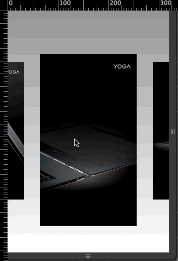

# EasySlide

Easy to build a mobile page slide.

----

### 介绍

EasySlide 不基于任何框架。它是一个可以快速、独立的制作H5 Mobile页面的微框架。

它包含`加载资源loader`，`页面切换`，`子类PPT`，`内部页面跳转`，`page layer`，`自定义动画效果`和`扩展动画效果`等功能。

使用EasySlide，可以不再使用javascript来设置动画顺序与效果，而只需要编写对应的动画类和设置HTML节点信息即可，它还内置一些utils和动画效果，你也可以使用监听器和自己编写CSS类来扩展EasySlide.



### 快速上手

首先需要引用对应的css和javascript，和要求的HTML结构，本框架只支持移动端，更多API见参考文档。

```html
<html>
   <head>
       <meta name="viewport" content="width=device-width,initial-scale=1.0,maximum-scale=1.0,minimum-scale=1.0,user-scalable=no" />
       <link href="reset.css" rel="stylesheet"> <!-- 或者你自己的reste css -->
       <link href="../EasySlide.css" rel="stylesheet"> <!-- EasySlide所依赖的css -->
       <script src="../EasySlide.js"></script> <!-- EasySlide所依赖的js -->
   </head>
   <body>
       <div class="EasySlide-warp" id="j_wrap">
           <div index="0" class="EasySlide-slides"> <!-- 一个page的容器 -->
               <div gindex="0" class="EasySlide-groups"> <!-- 一个page可以分成多个group来展示 -->
                  <div id="j_ppt"></div> <!-- ppt幻灯钩子 -->
               </div>
           </div>
           <div index="1" class="Easyslide-slides">
               <div gindex="0" class="EasySlide-groups">
                  <h1 class="EasySlide-animate" in="zoomIn" duration="1s" delay=".5s"></h1> <!-- 每个groups里的元素都可以通过EasySlide-animte来标记，在dom节点上直接做动画操作 -->
               </div>
           </div>
       </div>
       <script>
          var Slide = new EasySlide({
             replay:true, //每页动画都重新播放
             subpptObjects:[{
                wrapDiv:"j_ppt", //ppt类容器钩子
                img:["images/1.jpg","images/2.jpg","images/3.jpg","images/4.jpg"], //ppt展示的图片，最少4张
                parentNum:0 //所属slides的index
             }],
             wrapAll:"j_wrap" //整个slides的父容器
          });
          
          Slide.on("progress",function(percent){
             console.log(percent); //loading的百分比，可以自己定义loading层和动画
          });
          
          Slide.on("loaded",function(){
             //load资源结束，隐藏loading层，展示slide
          });
          
          //load对应图片资源
          Slide.load(["images/1.jpg","images/2.jpg","..."]);
       </script>
   </body>
</html>
```

### API

EasySlide.utils 

工具方法：

-----

EasySlide.utils.$

id选择器

EasySlide.utils.getByTagName

Tag选择器


EasySlide.utils.getByClsName

ClassName选择器


EasySlide.utils.makeElesArray

把类数组元素转换成数组元素


EasySlide.utils.attr

或者和设置属性方法

EasySlide.utils.bind

绑定DOM事件

EasySlide.utils.unbind

解绑DOM事件

EasySlide.utils.viewDate

获取窗口视图信息

EasySlide.utils.remove

删除DOM元素

EasySlide.utils.hide

隐藏DOM元素

EasySlide.utils.show

显示DOM元素

EasySlide.utils.hasAttr

查看DOM元素是否有自定义属性

EasySlide.utils.contain

查看是否包含对应className的元素

EasySlide.utils.isWeixin

检查是否是微信浏览器

EasySlide.utils.hasClass

检查是否包含对应cls

EasySlide.utils.shareWeibo

分享到微博

EasySlide.utils.mixin

属性拷贝方法

-----

EasySlide.STATIC

EasySlide.STATIC.flayerCls
EasySlide.STATIC.flayerTriggerCls
EasySlide.STATIC.animateCls
EasySlide.STATIC.groupCls
EasySlide.STATIC.slideCls

-----

EasySlide.Subppt.STATIC

EasySlide.Subppt.STATIC.slideCls
EasySlide.Subppt.STATIC.imgWrapCls

-----

EasySlide

方法

loader
goto
move

事件

progress
loaded
swipeY
swipeX
slide-switchEnd
ppt-switchEnd

初始化参数配置

wrapAll
SubpptObjects
replay

animate参数配置

in
delay
duration
tfunction
iteration

index
gindex
layerid
scroll
goto
allowswipe

-----

