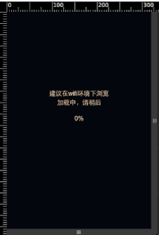

# EasySlide

Easy to build a mobile page slide.

----

### 介绍

EasySlide 不基于任何框架。它是一个可以快速、独立的制作H5 Mobile页面的微框架。

它包含`加载资源loader`，`页面切换`，`子类PPT`，`内部页面跳转`，`page layer`，`自定义动画效果`和`扩展动画效果`等功能。

使用EasySlide，可以不再使用javascript来设置动画顺序与效果，而只需要编写对应的动画类和设置HTML节点信息即可，它还内置一些utils和动画效果，你也可以使用监听器和自己编写CSS类来扩展EasySlide.

### Demo




```
gif图片较大，耐心等待刷出~，gif有丢帧，详细请clone本项目，打开demo文件夹查看，本地可运行。
```

### 快速上手

首先需要引用对应的css和javascript，和要求的HTML结构，本框架只支持移动端，更多API见参考文档。

```html
<html>
   <head>
       <meta name="viewport" content="width=device-width,initial-scale=1.0,maximum-scale=1.0,minimum-scale=1.0,user-scalable=no" />
       <link href="reset.css" rel="stylesheet"> <!-- 或者你自己的reste css -->
       <link href="../EasySlide.css" rel="stylesheet"> <!-- EasySlide所依赖的css -->
       <script src="../EasySlide.js"></script> <!-- EasySlide所依赖的js -->
   </head>
   <body>
       <div class="EasySlide-warp" id="j_wrap">
           <div index="0" class="EasySlide-slides"> <!-- 一个page的容器 -->
               <div gindex="0" class="EasySlide-groups"> <!-- 一个page可以分成多个group来展示 -->
                  <div id="j_ppt"></div> <!-- ppt幻灯钩子 -->
               </div>
           </div>
           <div index="1" class="Easyslide-slides">
               <div gindex="0" class="EasySlide-groups">
                  <h1 class="EasySlide-animate" in="zoomIn" duration="1s" delay=".5s">Title</h1> <!-- 每个groups里的元素都可以通过EasySlide-animte来标记，在dom节点上直接做动画操作 -->
               </div>
           </div>
       </div>
       <script>
          var Slide = new EasySlide({
             replay:true, //每页动画都重新播放
             subpptObjects:[{
                wrapDiv:"j_ppt", //ppt类容器钩子
                img:["images/1.jpg","images/2.jpg","images/3.jpg","images/4.jpg"], //ppt展示的图片，最少4张
                parentNum:0 //所属slides的index
             }],
             wrapAll:"j_wrap" //整个slides的父容器
          });
          
          Slide.on("progress",function(percent){
             console.log(percent); //loading的百分比，可以自己定义loading层和动画
          });
          
          Slide.on("loaded",function(){
             //load资源结束，隐藏loading层，展示slide
          });
          
          //load对应图片资源
          Slide.load(["images/1.jpg","images/2.jpg","..."]);
       </script>
   </body>
</html>
```

### API

-----

##### EasySlide

-----

#### 方法

-----

##### loader
```js
new EasySlide({
  
}).loader(["img1.jpg","img2.jpg"]);

//调用loader方法可以实现预加载图片资源，并可以监听到loaded和progress两个事件
```
#####goto
```js
var Slide = new EasySlide({});
Slide.goto(3);
//页面跳转到对应的slide index
```
##### move
```js
var Slide = new EasySlide({});
Slide.move(1) //-1 参数为1或者-1
//移动当前页面至前后一页
```

-----

#### 事件

-----

##### progress
##### loaded
```js
//loader只后，使用on方法可以监听到progress事件，回调第一个参数为百分比
var Slide = new EasySlide({});
Slide.on("progress",function(pre){
//xx.xx %
});
Slide.on("loaded",function(){
//load资源结束
});
Slide.loader(["1.jpg","2.jpg"]);
```
##### swipeY
##### swipeX
```js
var Slide = new EasySlide({});
Slide.on("swipeX",function(direction){
//direction为 1或者-1 代表方向
});
Slide.on("swipeY",function(direction){
//direction为 1或者-1 代表方向
});
```
##### slide-switchEnd
##### ppt-switchEnd
```js
var Slide = new EasySlide({});
Slide.on("slide-switchEnd",function(allowSwipe){
//slide翻页结束后触发，回调返回该页是否可被继续swipe，allowSwipe可能为next或者prev
});
Slide.on("ppt-switchEnd",function(direction){
//幻灯翻页结束后触发
});
```

-----

#### 初始化参数配置

-----

##### wrapAll
```js
//必填，所有slides的父节点id
```
##### SubpptObjects
```js
SubpptObjects:[{
   wrapDiv:"", //ppt节点id
   imgs:["1.jpg","2.jpg"], //ppt幻灯图片
   parentNum:0 //所在父节点的index值
}]
```
##### replay
```js
//布尔值，默认为false，表示动画结束后，再次翻到此页，是否重播动画，对所有slide生效。
```
##### firstTime
```js
第一屏第一轮是否可以回滚设置，默认为true，不可以
```
##### animateEffect
```
slide切换所使用的特效名称 默认 default, 可选:(card,rotate,flip,scale)
```
##### swipeDirection
```js
slide滑动方向，默认为 "y"
```

-----

#### animate参数配置
```
设置为class="EasySlide-animate"的节点，都可以配置如下参数
```
-----

##### in
```
默认自带得animate效果有zoomIn,fadeIn,fadeInDown,fadeInUp,pulse
可在EasySlide.css中找到，也可以自己增加。
```
##### delay
```
设置动画开始延迟时间 delay=".5s"
```
##### duration
```
设置动画总时间 duration="1s"
```
##### tfunction
```
设置动画的timing-function，默认ease
```
##### iteration
```
设置动画的iteration,默认是 1
```
-----

#### slide参数配置
```
设置为class="EasySlide-slides"下的子节点都可以配置如下参数
```
##### index
```
slide所属顺序
```
##### gindex
```
group所属顺序
```
##### layerid
```
点击某节点后弹出浮层的浮层id,对应用法需要在点击节点上设置flayerTriggerCls
```
##### scroll
```
当前层是否为带scroll y的节点，设置后，滚动条可用，如demo。
```
##### goto
```
点击节点后跳转至对应slide goto="3"
```
##### allowswipe
```
当前slide是否允许被滑动，可设置next和prev，不设置为上下均可滑动。
```
-----

##### EasySlide.STATIC
```
默认的EasySlide className储存位置，如果想自定义可以修改。
```
##### EasySlide.STATIC.flayerCls
##### EasySlide.STATIC.flayerTriggerCls
##### EasySlide.STATIC.animateCls
##### EasySlide.STATIC.groupCls
##### EasySlide.STATIC.slideCls

-----

##### EasySlide.Subppt.STATIC
```
默认的EasySlide subppt className储存位置，如果想自定义可以修改。
```
-----

##### EasySlide.Subppt.STATIC.slideCls
##### EasySlide.Subppt.STATIC.imgWrapCls

-----

##### EasySlide.utils 
```
一些常见的工具方法
```
-----

##### EasySlide.utils.$
```
id选择器
```
##### EasySlide.utils.getByTagName
```
Tag选择器
```
##### EasySlide.utils.getByClsName
```
ClassName选择器
```
##### EasySlide.utils.makeElesArray
```
把类数组元素转换成数组元素
```
##### EasySlide.utils.attr
```
或者和设置属性方法
```
##### EasySlide.utils.bind
```
绑定DOM事件
```
##### EasySlide.utils.unbind
```
解绑DOM事件
```
##### EasySlide.utils.viewDate
```
获取窗口视图信息
```
##### EasySlide.utils.remove
```
删除DOM元素
```
##### EasySlide.utils.hide
```
隐藏DOM元素
```
##### EasySlide.utils.show
```
显示DOM元素
```
##### EasySlide.utils.hasAttr
```
查看DOM元素是否有自定义属性
```
##### EasySlide.utils.contain
```
查看是否包含对应className的元素
```
##### EasySlide.utils.isWeixin
```
检查是否是微信浏览器
```
##### EasySlide.utils.hasClass
```
检查是否包含对应cls
```
##### EasySlide.utils.shareWeibo
```
分享到微博
```
##### EasySlide.utils.mixin
```
属性拷贝方法
```
-----
